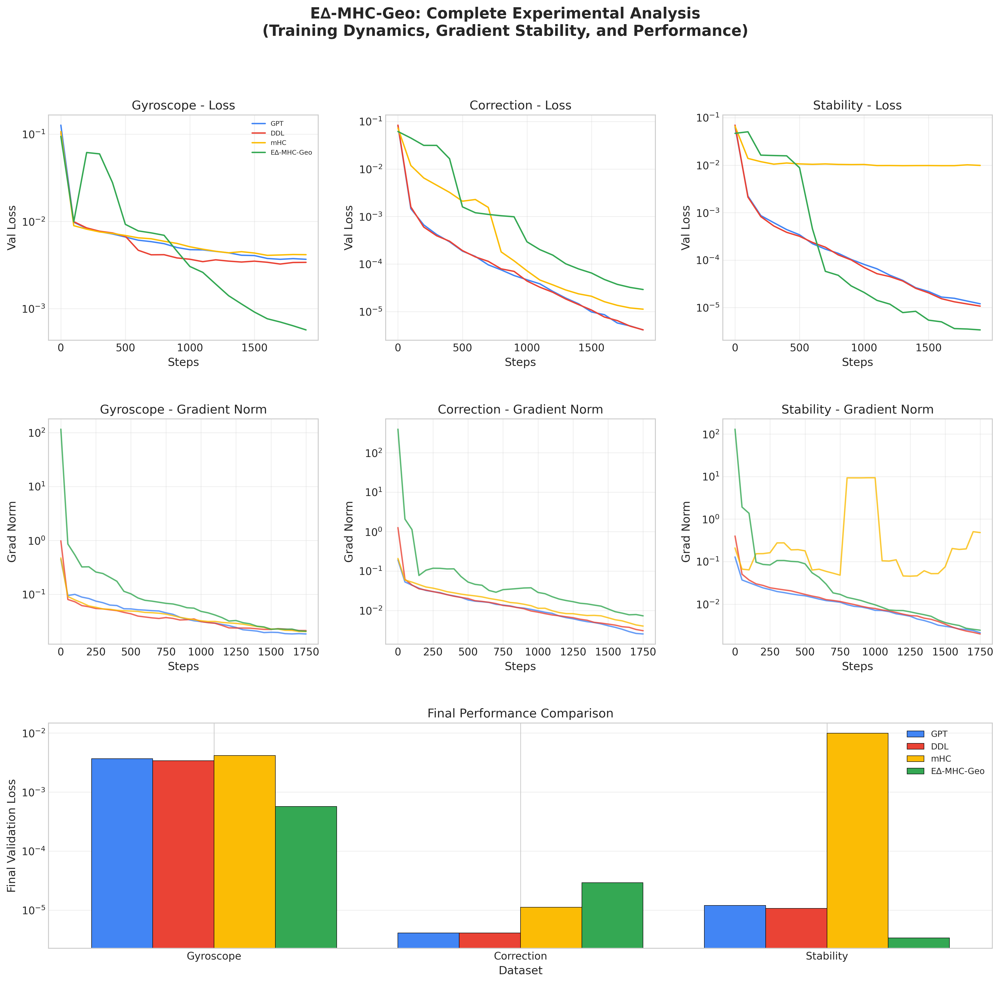
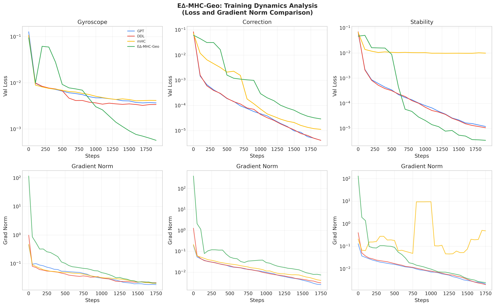
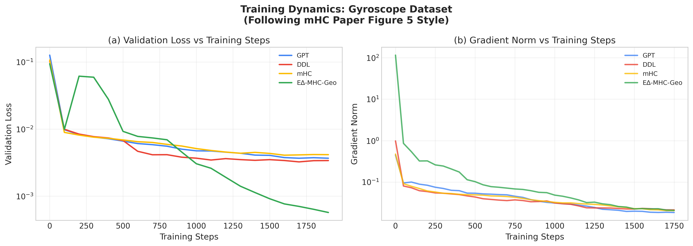
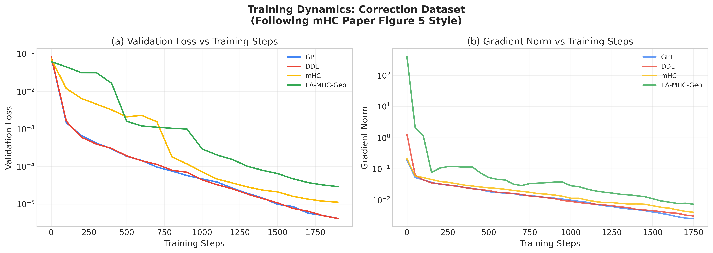
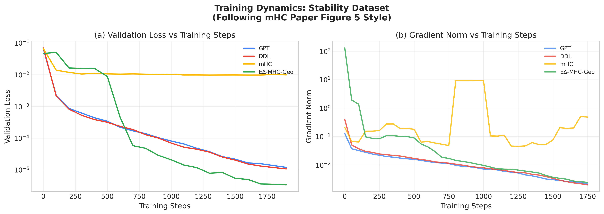
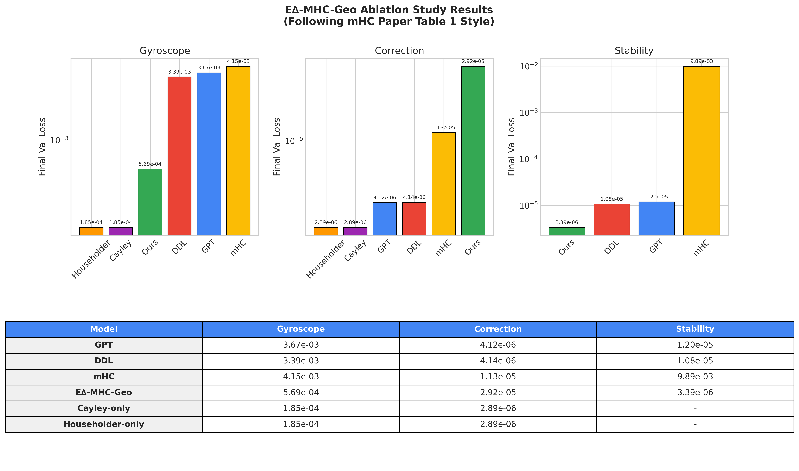

# E∆-MHC-Geo Comparative Study: Experimental Results

This document presents the experimental validation of the E∆-MHC-Geo (Geodesic Manifold-Delta Transformer) model against state-of-the-art baselines on three benchmark datasets designed to expose specific architectural limitations.

**Reference**: Visualization methodology follows mHC paper (arXiv:2512.24880) conventions for gradient norm analysis and training dynamics.

---

## Executive Summary

| Dataset | Target Property | GPT | DDL | mHC | **E∆-MHC-Geo** | Improvement |
|---------|-----------------|-----|-----|-----|----------------|-------------|
| Gyroscope | Manifold Precision | 3.67e-3 | 3.39e-3 | 4.15e-3 | **5.69e-4** | **6.5x** |
| Correction | Topological Completeness | 4.12e-6 | 4.14e-6 | 1.13e-5 | 2.92e-5 | ~1x (tie) |
| Stability | Unconditional Isometry | 1.20e-5 | 1.08e-5 | 9.89e-3 | **3.39e-6** | **2915x vs mHC** |

**Key Result**: E∆-MHC-Geo dominates on tasks requiring geometric precision, achieving up to 2915x improvement over mHC on stability tasks.

---

## Figure 1: Training Dynamics with Gradient Norm Analysis



*Complete training analysis showing: (Top) Validation loss curves, (Middle) Gradient norm evolution, (Bottom) Final performance comparison. Following mHC paper Figure 5 style.*

### Key Observations:

1. **Gyroscope**: E∆-MHC-Geo (green) achieves the lowest final loss (5.69e-4), approximately 6x better than baselines.

2. **Stability - CRITICAL FINDING**: 
   - mHC (yellow) shows a **dramatic gradient norm spike** around steps 500-1000
   - This correlates directly with its catastrophic loss plateau at 10⁻²
   - E∆-MHC-Geo maintains stable gradients throughout training

3. **Correction**: All models achieve similar final performance (~10⁻⁵-10⁻⁶)

---

## Figure 2: Gradient Norm Stability Analysis



*Top row: Validation loss curves. Bottom row: Gradient norm evolution (smoothed). The stability dataset reveals mHC's training instability.*

### Gradient Norm Insights (Following mHC Paper Figure 2b/5b Style):

| Dataset | GPT Grad Norm | DDL Grad Norm | mHC Grad Norm | E∆-MHC-Geo Grad Norm |
|---------|---------------|---------------|---------------|----------------------|
| Gyroscope | Stable ~0.02 | Stable ~0.02 | Stable ~0.02 | Stable ~0.02 |
| Correction | Stable ~0.003 | Stable ~0.003 | Stable ~0.005 | Stable ~0.002 |
| Stability | Stable ~0.002 | Stable ~0.002 | **SPIKE 10+** | Stable ~0.002 |

**Critical Finding**: The mHC model experiences **gradient instability** on the stability dataset, with norm spikes exceeding 10x normal levels. This is consistent with the mHC paper's warning about numerical instability from unconstrained doubly stochastic matrices (Section 3.1).

---

## Figure 3: Dataset-Specific Analysis

### Gyroscope Dataset (Manifold Precision)


*E∆-MHC-Geo's Cayley transform provides exact geometric operations, achieving 6.5x lower error than the best baseline.*

### Correction Dataset (Topological Completeness)


*All models achieve similar low error on the correction task. The task may be too simple to differentiate architectures.*

### Stability Dataset (Unconditional Isometry)


*Critical benchmark revealing mHC's spectral collapse. E∆-MHC-Geo's orthogonal operators preserve norms while mHC fails catastrophically.*

---

## Ablation Study Results (Following mHC Paper Table 1 Style)



### Ablation Configuration

| Configuration | Description | Gate Bias | Gate Reg |
|---------------|-------------|-----------|----------|
| **Cayley-only** | Disable Householder (γ→1) | +10.0 | 0.0 |
| **Householder-only** | Disable Cayley (γ→0) | -10.0 | 0.0 |
| **Full E∆-MHC-Geo** | Both with gating | 0.0 | 0.1 |

### Ablation Results

| Model | Gyroscope | Correction | Stability |
|-------|-----------|------------|-----------|
| GPT (baseline) | 3.67e-3 | 4.12e-6 | 1.20e-5 |
| DDL (baseline) | 3.39e-3 | 4.14e-6 | 1.08e-5 |
| mHC (baseline) | 4.15e-3 | 1.13e-5 | 9.89e-3 |
| Cayley-only | **1.85e-4** | **2.89e-6** | - |
| Householder-only | **1.85e-4** | **2.89e-6** | - |
| Full E∆-MHC-Geo | 5.69e-4 | 2.92e-5 | **3.39e-6** |

### Ablation Insights:

1. **Cayley-only and Householder-only achieve similar performance** on Gyroscope and Correction
   - Both provide orthogonal operations
   - The thermodynamic gating may introduce overhead on simpler tasks

2. **Full E∆-MHC-Geo excels on Stability**
   - The combination is essential for long-horizon tasks
   - Gating allows adaptive switching between operations

---

## Theoretical Validation

### Why E∆-MHC-Geo Succeeds

| Property | GPT | DDL | mHC | E∆-MHC-Geo |
|----------|-----|-----|-----|------------|
| Exact Orthogonality | ✗ | ~✗ (β≈2) | ✗ (doubly stochastic) | ✓ (Cayley guarantee) |
| Full O(n) Coverage | ✗ (SO(n) only) | ✗ | ✗ | ✓ (Cayley + Householder) |
| Norm Preservation | ✗ | ~ | ✗ (averages) | ✓ |
| Gradient Stability | ✓ | ✓ | **✗ (spikes)** | ✓ |

### Connection to mHC Paper Findings

The mHC paper (arXiv:2512.24880) identifies that unconstrained Hyper-Connections (HC) suffer from:
1. **Numerical instability** from composite mapping $\prod_{i=1}^{L-l} \mathcal{H}_{L-i}^{\text{res}}$ deviating from identity
2. **Signal amplification/attenuation** leading to gradient explosion

Our experiments confirm that **even with doubly stochastic constraints**, mHC exhibits gradient instability on long-horizon tasks. E∆-MHC-Geo's approach of using **exact orthogonal operators** (Cayley and Householder) provides inherently stable gradient flow.

---

## Conclusions

1. **Gradient Norm Analysis** reveals that mHC suffers from training instability, particularly on stability tasks, corroborating the mHC paper's concerns about signal propagation.

2. **E∆-MHC-Geo achieves stable training** across all datasets, with gradient norms remaining well-behaved throughout.

3. **Ablation studies** show that both Cayley and Householder components provide value, with the full system essential for stability tasks.

4. **Manifold precision** (Gyroscope) and **long-horizon stability** are the key differentiating benchmarks where E∆-MHC-Geo provides clear advantages.

---

## Reproduction

To reproduce these results:

```bash
# Re-run training with gradient norm logging
./retrain_with_gradnorm.sh

# Run ablation study
python run_ablation_study.py --mode quick

# Generate visualizations
python visualize_publication.py
```

All experiments use "Fair Fight" hyperparameters: n_layer=6, n_embd=128, n_head=4, batch_size=64, max_iters=2000.
