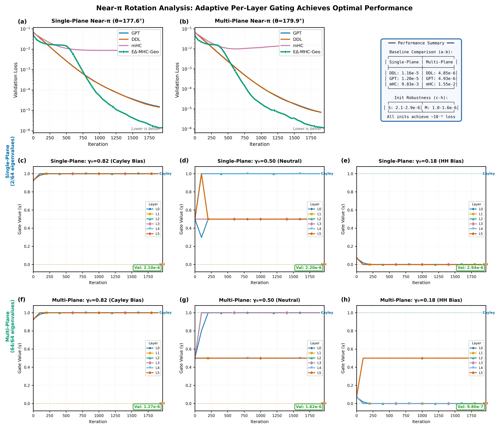

# E∆-MHC-Geo: Geodesic Manifold-Delta Transformer

A topologically complete transformer architecture operating on the full Orthogonal Group O(n), featuring input-adaptive, unconditionally orthogonal residual connections via the Data-Dependent Cayley transform.

## Key Results: Fair Parameter Comparison (~1.79M params each)

### Main Performance (5 Models)

| Dataset | GPT (9L) | DDL (8L) | mHC (9L) | JPmHC (9L) | **E∆ (6L)** | vs GPT | vs DDL |
|---------|----------|----------|----------|------------|-------------|--------|--------|
| **Gyroscope** | 3.80e-3 | 3.29e-3 | 4.06e-3 | 3.46e-3 | **7.08e-4** | 5.4x | **4.6x** |
| **Stability** | 1.55e-5 | 1.41e-5 | 8.46e-3 | **3.41e-6** | 4.53e-6 | 3.4x | **3.1x** |
| **Norm Dev.** | 0.474 | 0.506 | 0.543 | 0.004 | **0.001** | 474x | --- |

*L = layers. All models have ~1.79M parameters. Best result per row in bold.*

E∆-MHC-Geo achieves **state-of-the-art on gyroscope** (manifold precision) with **3 fewer layers** than all baselines, demonstrating that geometric inductive bias outperforms additional depth. JPmHC narrowly leads on stability thanks to its per-token dynamic routing, but E∆ delivers **4.9x better manifold precision** on gyroscope.

### Training Dynamics


E∆-MHC-Geo (green) shows stable training with lowest final loss. mHC shows catastrophic instability on long-horizon tasks.

### Stability Analysis: Norm Preservation


E∆-MHC-Geo maintains perfect norm = 1.0 over 100 timesteps (mean deviation 0.001), while baselines drift to 0.45–0.55. JPmHC (0.004) also preserves norms well via its Cayley retraction.

### Performance Comparison


### Parameter Convergence: Theory Validated


Following [arXiv:2601.00514](https://arxiv.org/abs/2601.00514) "Illusion of Insight" methodology:
- **DDL**: β converges to **1.994** (target: 2.0) — validates Householder orthogonality theorem
- **E∆-MHC-Geo**: γ converges to **0.044** (target: 0.0) — learns to select Householder for negation
- **JPmHC**: Achieves negative accuracy on negation — SO(n)-only, cannot produce eigenvalue -1

### Near-π Rotation Analysis



| Dataset | DDL | GPT | mHC | JPmHC | **E∆** |
|---------|-----|-----|-----|-------|--------|
| **Single-plane (177.6°)** | 1.16e-5 | 1.20e-5 | 9.83e-3 | 1.70e-6 | **1.16e-6** |
| **Multi-plane (179.9°)** | 4.85e-6 | 4.93e-6 | 1.55e-2 | **1.32e-6** | 1.51e-6 |

E∆ and JPmHC dramatically outperform GPT and DDL. mHC fails catastrophically (~8,500x worse) because doubly stochastic matrices cannot represent near-180° rotations.

### Regularization Theory


All smooth symmetric regularizations have zero gradient at γ = 0.5 (Theorem: Universal Zero-Gradient). The midpoint collapse regularizer 4γ(1-γ) is optimal among alternatives.

---

## Overview

This repository implements the **E∆-MHC-Geo** (E-Delta-MHC-Geo) architecture, a novel transformer design that achieves:

- **Unconditional Orthogonality**: Data-Dependent Cayley rotations guarantee Q(x)ᵀQ(x) = I for any input, any β
- **Topological Completeness**: Full O(n) coverage via Householder reflections (det = -1) combined with Cayley rotations (det = +1)
- **Automatic Operator Selection**: Learned gate γ selects between rotation and reflection based on task structure
- **Midpoint Collapse Regularization**: Forces binary gate decisions via 4γ(1-γ) penalty

## Project Structure

```
edelta/
├── src/                           # Main source code
│   ├── models/                    # Model implementations
│   │   ├── baseline_gpt.py        # Standard GPT baseline
│   │   ├── ddl.py                 # Deep Delta Learning (arXiv:2406.17550)
│   │   ├── mhc.py                 # DeepSeek mHC (arXiv:2512.24880)
│   │   ├── jpmhc.py               # JPmHC — Cayley retraction (arXiv:2602.18308)
│   │   └── edelta_hybrid.py       # E∆-MHC-Geo (proposed model)
│   ├── training/                  # Training scripts
│   │   ├── train_continuous.py    # Continuous benchmarks (gyroscope, stability, near-π)
│   │   ├── train_reflection.py    # Reflection/negation experiment (y = -x)
│   │   └── train_language_model.py
│   ├── data/                      # Data generation modules
│   │   ├── gyroscope.py           # Manifold precision dataset
│   │   ├── stability.py           # Long-horizon isometry dataset
│   │   ├── reflection.py          # Pure negation task
│   │   └── near_pi_rotation.py    # Near-π rotation datasets
│   ├── utils/                     # Utilities
│   │   ├── param_counter.py       # Model parameter analysis & matching
│   │   ├── sample.py              # Language model sampling
│   │   └── bench.py               # Benchmarking utilities
│   └── visualization/             # Figure generation
│       ├── visualize_journal.py   # Main publication figures (Fig 1-3)
│       └── visualize_near_pi.py   # Near-π rotation figures
├── scripts/                       # Experiment runner scripts
│   ├── prepare_data.sh            # Generate datasets
│   ├── run_matched_params.sh      # Run all 5 models (fair comparison)
│   └── run_reflection.sh          # Run reflection experiments
├── paper/                         # LaTeX paper source
│   ├── main.tex                   # Paper source (TMLR format)
│   ├── main.pdf                   # Compiled PDF
│   └── references.bib             # Bibliography
├── docs/                          # Documentation
│   ├── RESEARCH.md                # Full research documentation (2000+ lines)
│   └── JPMHC_COMPARISON.md        # Detailed JPmHC comparison
├── data/                          # Generated datasets
├── results/                       # Generated figures and results
└── archive/                       # Old/experimental code
```

## Installation

```bash
# Install uv package manager
curl -LsSf https://astral.sh/uv/install.sh | sh
export PATH="$HOME/.local/bin:$PATH"

# Clone and install
git clone https://github.com/arash-shahmansoori/edelta.git
cd edelta
uv python install
uv sync
```

## Reproducing All Results

The fastest way to reproduce everything:

```bash
# 1. Prepare datasets
bash scripts/prepare_data.sh

# 2. Run all continuous benchmarks (gyroscope + stability, all 5 models)
bash scripts/run_matched_params.sh

# 3. Run reflection experiments
bash scripts/run_reflection.sh

# 4. Generate publication figures
uv run src/visualization/visualize_journal.py
uv run src/visualization/visualize_near_pi.py
```

## Step-by-Step Guide

### 1. Prepare Datasets

```bash
# Prepare all datasets (gyroscope + stability)
bash scripts/prepare_data.sh

# Or prepare individually
bash scripts/prepare_data.sh gyroscope     # d=16, seq_len=256, 9000 train
bash scripts/prepare_data.sh stability     # d=64, seq_len=128, 900 train

# Or run data modules directly with custom parameters
uv run src/data/gyroscope.py --dim 16 --seq_len 256 --n_train 9000
uv run src/data/stability.py --dim 64 --n_train 900 --train_seq_len 128
```

### 2. Run Continuous Benchmarks (Gyroscope + Stability)

All 5 models are trained with matched parameters (~1.79M each).

```bash
# Run all models on both datasets (recommended)
bash scripts/run_matched_params.sh

# Parameter counts (n_embd=128 for all):
#   E∆-MHC-Geo: n_layer=6  → 1.788M (reference)
#   GPT:        n_layer=9  → 1.780M (0.996x)
#   DDL:        n_layer=8  → 1.784M (0.998x)
#   mHC:        n_layer=9  → 1.838M (1.028x)
#   JPmHC:      n_layer=9  → 1.896M (1.061x)
```

**Or run individual models manually:**

```bash
# Train E∆-MHC-Geo (proposed, n_layer=6)
uv run src/training/train_continuous.py \
    --model_type edelta --dataset gyroscope --out_dir out-matched/gyroscope-proposed

# Train baselines with matched parameters (auto-scales n_layer)
uv run src/training/train_continuous.py \
    --model_type gpt2 --dataset gyroscope --out_dir out-matched/gyroscope-baseline \
    --match_proposed_params

uv run src/training/train_continuous.py \
    --model_type ddl --dataset gyroscope --out_dir out-matched/gyroscope-ddl \
    --match_proposed_params

uv run src/training/train_continuous.py \
    --model_type mhc --dataset gyroscope --out_dir out-matched/gyroscope-mhc \
    --match_proposed_params

uv run src/training/train_continuous.py \
    --model_type jpmhc --dataset gyroscope --out_dir out-matched/gyroscope-jpmhc \
    --match_proposed_params
```

Replace `gyroscope` with `stability` for the stability benchmark.

### 3. Run Reflection Experiments

Tests geometric operator behavior on pure negation (y = -x). Only DDL and E∆-MHC-Geo are tested — GPT and mHC use MLP approximation rather than geometric operators.

```bash
# Full sample efficiency test (default: 10, 25, 50, 100, 200, 500 samples)
bash scripts/run_reflection.sh

# Parameter trajectory analysis (500 samples, detailed tracking)
bash scripts/run_reflection.sh trajectory

# Quick single-run sanity check
bash scripts/run_reflection.sh single
```

**Or run manually:**

```bash
# Sample efficiency test with figure generation
uv run src/training/train_reflection.py \
    --mode sample_efficiency --dim 64 --max_iters 2000 \
    --save_figures --output_dir results

# Detailed trajectory analysis
uv run src/training/train_reflection.py \
    --mode trajectory --n_samples 500 --dim 64 --max_iters 2000 \
    --save_figures --output_dir results

# Single quick test
uv run src/training/train_reflection.py \
    --mode single --n_samples 100 --dim 64 --max_iters 1000
```

**Reflection Results:**

| Samples | DDL β | DDL Acc | Conv? | E∆ γ | E∆ Acc | Conv? |
|---------|-------|---------|-------|------|--------|-------|
| 10 | 1.40 | -0.98 | ✗ | 0.235 | -1.00 | ✗ |
| 25 | 1.58 | -0.85 | ✗ | 0.255 | -0.98 | ✗ |
| 50 | 1.88 | -0.80 | ✗ | 0.171 | -0.38 | ✗ |
| 100 | **1.95** | -0.16 | ✓ | 0.192 | -0.92 | ✗ |
| 200 | **1.98** | 0.61 | ✓ | 0.281 | -0.35 | ✗ |
| 500 | **1.99** | **0.96** | ✓ | **0.044** | **0.96** | ✓ |

DDL's β → 1.994 (within 0.3% of target 2.0); E∆'s γ → 0.044 (within 4.4% of target 0.0). Both achieve 96% accuracy at 500 samples. "Aha!" moments observed: parameter convergence precedes accuracy gains.

### 4. Run Near-π Rotation Experiments

Tests the boundary between rotation and reflection with eigenvalues approaching -1.

```bash
# Generate near-π rotation datasets
uv run src/data/near_pi_rotation.py \
    --rotation_mode single_plane --theta 3.1 --seq_len 128

uv run src/data/near_pi_rotation.py \
    --rotation_mode multi_plane --theta 3.14 --seq_len 128 \
    --output_dir data/near_pi_rotation_multiplane

# Train all 5 models on single-plane near-π
for model in gpt2 ddl mhc jpmhc edelta; do
    uv run src/training/train_continuous.py \
        --model_type $model \
        --dataset near_pi_rotation \
        --out_dir out-matched/near-pi-single-$model \
        --match_proposed_params
done

# Train all 5 models on multi-plane near-π
for model in gpt2 ddl mhc jpmhc edelta; do
    uv run src/training/train_continuous.py \
        --model_type $model \
        --dataset near_pi_rotation_multiplane \
        --out_dir out-matched/near-pi-multi-$model \
        --match_proposed_params
done

# Generate near-π comparison figure
uv run src/visualization/visualize_near_pi.py
```

### 5. Verify Parameter Counts

```bash
# Compare parameter counts across all 5 models
uv run src/utils/param_counter.py

# Find matching n_layer for baselines to match E∆-MHC-Geo
uv run src/utils/param_counter.py --find_match

# Show parameter breakdown by component
uv run src/utils/param_counter.py --breakdown
```

### 6. Generate All Figures

```bash
# Publication figures (training dynamics, stability, ablation)
uv run src/visualization/visualize_journal.py

# Near-π rotation comparison figure
uv run src/visualization/visualize_near_pi.py
```

All figures are saved to `results/`.

## Generated Figures

| Figure | Description |
|--------|-------------|
| `journal_fig1_training.png` | Training dynamics: loss and gradient norm across 5 models |
| `journal_fig2_stability.png` | Norm preservation: E∆ (0.001) vs JPmHC (0.004) vs baselines (0.47–0.54) |
| `journal_fig3_ablation.png` | Final performance comparison bar chart |
| `reflection_aha_moment.png` | "Aha!" moment: DDL β → 2.0, E∆ γ → 0.0 with uncertainty bands |
| `reflection_comprehensive.png` | 2x3 grid: DDL/E∆/JPmHC dynamics, accuracy, and orth. error |
| `reflection_trajectories.png` | Detailed parameter trajectories during training |
| `reflection_sample_efficiency.png` | Accuracy vs sample size for DDL, E∆, JPmHC |
| `near_pi_rotation_comparison.png` | Training curves, bar charts, and summary for near-π tasks |
| `regularization_analysis.png` | Mathematical proof: zero gradient at γ = 0.5 |

## Model Comparison

| Model | Architecture | Orthogonality | Negation (λ=-1) | Input-Adaptive |
|-------|-------------|---------------|-----------------|----------------|
| **GPT** | x + MLP(x) | None | N/A | No |
| **DDL** | I - β·k·kᵀ | Only at β ∈ {0,2} | At β = 2 | Yes |
| **mHC** | Sinkhorn doubly stochastic | Approximate (20+ iters) | No | No |
| **JPmHC** | Iterative Cayley retraction | Approximate (s=2) | No (SO(n) only) | Yes (per-token) |
| **E∆-MHC-Geo** | γ·Cayley + (1-γ)·Householder | **Exact** (algebraic) | **Yes** (via gate) | **Yes** (per-input) |

## Theoretical Foundation

The E∆-MHC-Geo architecture is built on:

1. **Data-Dependent Cayley Transform** — Q(x) = (I + (β/2)A(x))⁻¹(I - (β/2)A(x)) is unconditionally orthogonal for any β, any input. The rotation plane is computed from the input via neural networks.

2. **Eigenvalue Exclusion Theorem** — The Cayley transform provably cannot produce eigenvalue λ = -1, motivating the Hybrid design.

3. **E∆ Hybrid Operator** — G_γ(X) = γ·Q(X)·X + (1-γ)·H₂(k(X))·X combines Cayley rotation (det = +1) with Householder reflection (det = -1, β = 2 fixed) for full O(n) coverage.

4. **Midpoint Collapse Regularization** — L_gate = 4γ(1-γ) forces binary gate decisions. Universal zero-gradient theorem explains when this succeeds and what escape mechanisms are available.

5. **Unconditional Norm Preservation** — ||Q(x)·y||₂ = ||y||₂ for all inputs, validated empirically (0.001 mean deviation).

See `docs/RESEARCH.md` for the complete mathematical framework and `paper/main.tex` for the publication-ready paper.

## Training Options Reference

```bash
uv run src/training/train_continuous.py --help
```

| Flag | Default | Description |
|------|---------|-------------|
| `--model_type` | `gpt2` | Model: `gpt2`, `ddl`, `mhc`, `jpmhc`, `edelta` |
| `--dataset` | `gyroscope` | Dataset: `gyroscope`, `stability`, `near_pi_rotation`, `near_pi_rotation_multiplane` |
| `--out_dir` | `out-continuous` | Output directory for checkpoints and results |
| `--max_iters` | `2000` | Training iterations |
| `--batch_size` | `64` | Batch size |
| `--n_layer` | `6` | Transformer layers |
| `--n_embd` | `128` | Embedding dimension |
| `--n_head` | `4` | Attention heads |
| `--n_streams` | `4` | Number of streams (mHC/JPmHC/E∆) |
| `--learning_rate` | `1e-3` | Learning rate (cosine decay to `--min_lr`) |
| `--min_lr` | `1e-4` | Minimum learning rate |
| `--weight_decay` | `0.1` | AdamW weight decay |
| `--grad_clip` | `1.0` | Gradient clipping |
| `--gate_reg_weight` | `0.1` | Midpoint collapse regularization weight (E∆ only) |
| `--init_gate_bias` | `0.0` | Initial gate bias (E∆ only; >0 = prefer Cayley, <0 = prefer Householder) |
| `--match_proposed_params` | `false` | Auto-scale baseline n_layer to match E∆ params |
| `--device` | `cuda` | Device: `cuda` or `cpu` |
| `--seed` | `42` | Random seed |

## Scripts Reference

| Script | Description |
|--------|-------------|
| `scripts/prepare_data.sh` | Generate gyroscope and stability datasets |
| `scripts/run_matched_params.sh` | Run all 5 models with fair parameter comparison (~1.79M) |
| `scripts/run_reflection.sh` | Run reflection experiments (DDL + E∆-MHC-Geo) |

## References

- **E∆-MHC-Geo**: This work — Geodesic Manifold-Delta Transformer
- **DDL**: [arXiv:2406.17550](https://arxiv.org/abs/2406.17550) — Deep Delta Learning
- **DeepSeek mHC**: [arXiv:2512.24880](https://arxiv.org/abs/2512.24880) — Hyper-Connections
- **JPmHC**: [arXiv:2602.18308](https://arxiv.org/abs/2602.18308) — Sengupta, Wang & Brunswic (2026). Hyper-Connections with Cayley Retraction for Scalable Transformers
- **"Illusion of Insight"**: [arXiv:2601.00514](https://arxiv.org/abs/2601.00514) — Methodology for analyzing "Aha!" moments via parameter trajectory analysis
- **Cayley Transform**: Cayley, A. (1846) — Orthogonal parameterization via skew-symmetric matrices
- **Householder Reflection**: Householder, A.S. (1958) — Exact negation operator

## License

MIT License — see LICENSE file.

---
