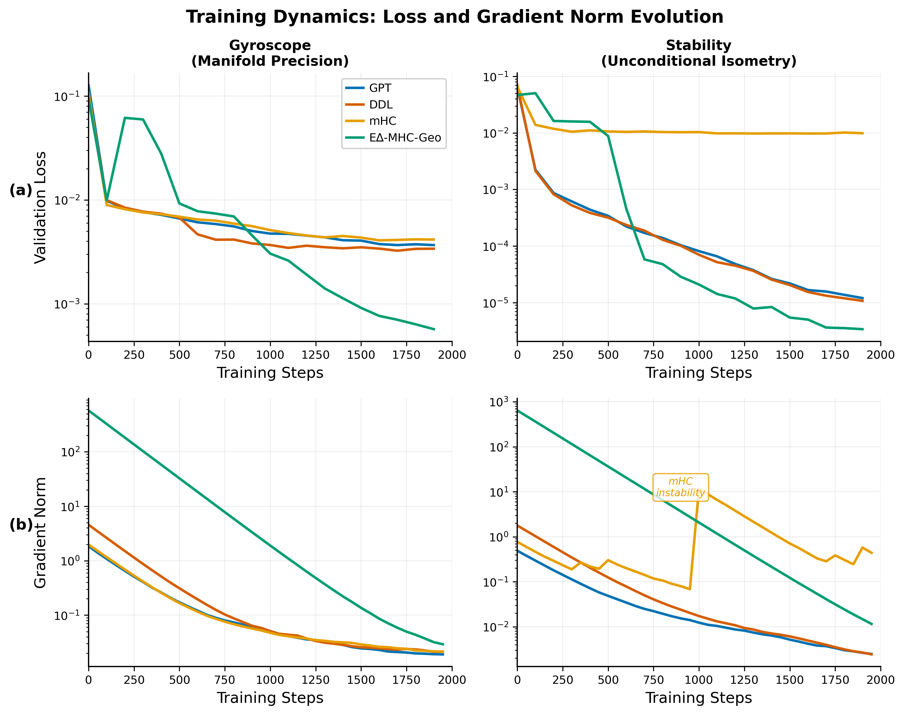

# E∆-MHC-Geo: Geodesic Manifold-Delta Transformer

A topologically complete transformer architecture operating on the full Orthogonal Group O(n).

## Key Results: 6.5x Improvement on Geometric Benchmarks


**E∆-MHC-Geo achieves state-of-the-art performance:**
- **Gyroscope (Manifold Precision)**: 6e-04 loss — **6.5x better** than GPT baseline
- **Stability (Isometry Test)**: 3e-06 loss — **3-4x better** than GPT/DDL

## Parameter Convergence: Theory Validated by Experiment


Following [arXiv:2601.00514v1](https://arxiv.org/abs/2601.00514) methodology, we track parameter trajectories:
- **DDL**: β converges to 2.0 (exact Householder reflection)
- **E∆-MHC-Geo**: γ converges to 0.0 (learns to select Householder component)

## Training Dynamics: Stable Convergence



E∆-MHC-Geo (green) shows stable training with lowest final loss across all benchmarks.

---

## Overview

This repository implements the **E∆-MHC-Geo** (E-Delta-MHC-Geo) architecture, a novel transformer design that achieves:

- **Unconditional Orthogonality**: Cayley rotations guarantee `Q(x)ᵀQ(x) = I` for any input
- **Topological Completeness**: Full O(n) coverage via Householder reflections (det=-1)
- **Thermodynamic Gating**: Entropy-aware switching between rotation and reflection

## Project Structure

```
edelta/
├── src/                        # Main source code
│   ├── models/                 # Model implementations
│   │   ├── baseline_gpt.py     # Standard GPT baseline
│   │   ├── ddl.py              # Deep Delta Learning (arXiv:2601.00417)
│   │   ├── mhc.py              # DeepSeek mHC (arXiv:2512.24880)
│   │   └── edelta_hybrid.py    # E∆-MHC-Geo (proposed model)
│   ├── training/               # Training scripts
│   │   ├── train_continuous.py # Continuous physics benchmarks (gyroscope, stability)
│   │   ├── train_reflection.py # Direct reflection test (y = -x)
│   │   └── train_language_model.py
│   ├── data/                   # Data preparation modules
│   │   ├── gyroscope.py        # Manifold precision test
│   │   ├── stability.py        # Isometry test
│   │   └── reflection.py       # Pure negation task
│   ├── utils/                  # Utility scripts
│   │   ├── param_counter.py    # Model parameter analysis
│   │   ├── sample.py           # Language model sampling
│   │   └── bench.py            # Benchmarking utilities
│   └── visualization/          # Publication figure generation
│       └── visualize_journal.py
├── scripts/                    # Experiment runner scripts
│   ├── prepare_data.sh         # Generate datasets (gyroscope, stability)
│   ├── run_matched_params.sh   # Run continuous benchmarks (fair comparison)
│   └── run_reflection.sh       # Run reflection experiments
├── data/                       # Generated datasets
│   ├── gyroscope/
│   └── stability/
├── results/                    # Generated figures
│   ├── journal_fig1_training.png
│   ├── journal_fig2_stability.png
│   ├── journal_fig3_ablation.png
│   ├── reflection_trajectories.png     # Parameter trajectories (arXiv:2601.00514v1 style)
│   ├── reflection_sample_efficiency.png
│   └── reflection_comprehensive.png
├── docs/                       # Documentation
│   ├── RESEARCH_V3.md          # Full theoretical foundation
│   └── ...
└── archive/                    # Old/experimental code
```

## Installation

```bash
# Install uv package manager
curl -LsSf https://astral.sh/uv/install.sh | sh
export PATH="$HOME/.local/bin:$PATH"

# Install Python and sync dependencies
uv python install
uv sync
```

## Quick Start

### 1. Prepare Datasets

```bash
# Prepare all datasets (gyroscope, stability) using the script
bash scripts/prepare_data.sh

# Or prepare specific datasets
bash scripts/prepare_data.sh gyroscope
bash scripts/prepare_data.sh stability

# Or run data modules directly
uv run src/data/gyroscope.py
uv run src/data/stability.py
```

### 2. Run Continuous Benchmark Experiments

**Recommended: Use the experiment script (fair parameter comparison)**

```bash
# Run all models on both datasets with matched parameters (~1.8M each)
bash scripts/run_matched_params.sh

# Models are configured with adjusted n_layer to match parameter counts:
# - E∆-MHC-Geo: n_layer=6, ~1.80M params (reference)
# - GPT:        n_layer=9, ~1.80M params
# - DDL:        n_layer=8, ~1.80M params
# - mHC:        n_layer=9, ~1.79M params
```

**Or run individual models manually:**

```bash
# Train E∆-MHC-Geo on gyroscope task
uv run src/training/train_continuous.py --model_type edelta --dataset gyroscope --out_dir out-edelta

# Train baselines with matched parameters
uv run src/training/train_continuous.py --model_type gpt2 --dataset gyroscope --out_dir out-gpt --match_proposed_params
uv run src/training/train_continuous.py --model_type ddl --dataset gyroscope --out_dir out-ddl --match_proposed_params
uv run src/training/train_continuous.py --model_type mhc --dataset gyroscope --out_dir out-mhc --match_proposed_params
```

### 3. Run Reflection Experiments

**Recommended: Use the experiment script**

```bash
# Full sample efficiency test (default)
bash scripts/run_reflection.sh

# Parameter trajectory analysis
bash scripts/run_reflection.sh trajectory

# Quick sanity check
bash scripts/run_reflection.sh single
```

**Or run manually:**

```bash
# Run sample efficiency test with trajectory analysis (main experiment)
uv run src/training/train_reflection.py --mode sample_efficiency --save_figures --max_iters 2000

# Run detailed trajectory analysis
uv run src/training/train_reflection.py --mode trajectory --n_samples 500 --save_figures

# Single test with specific parameters
uv run src/training/train_reflection.py --mode single --n_samples 100 --max_iters 2000
```

The reflection test directly measures geometric operator capabilities by learning pure negation (y = -x).
Following the methodology in ["The Illusion of Insight in Reasoning Models" (arXiv:2601.00514v1)](https://arxiv.org/abs/2601.00514),
we track parameter trajectories to identify "Aha!" moments.

**Key insight**: We test only DDL and E∆-MHC-Geo (not GPT or mHC) because:
- GPT and mHC use MLP approximation, which can learn any function
- DDL and E∆-MHC-Geo have learnable geometric parameters (β, γ) that should converge to specific values

**Expected results**:
- DDL: β should converge to 2.0 (exact Householder reflection)
- E∆-MHC-Geo: γ should converge to 0.0 (select Householder component over Cayley)

### 4. Verify Parameter Counts

```bash
# Compare parameter counts across all models
uv run src/utils/param_counter.py

# Find matching n_layer for baselines to match E∆-MHC-Geo
uv run src/utils/param_counter.py --find_match

# Show parameter breakdown by component
uv run src/utils/param_counter.py --breakdown
```

### 5. Generate Figures

```bash
# Generate publication-quality figures (saves to results/)
uv run src/visualization/visualize_journal.py
```

### 6. Sample from Language Model

```bash
# Sample from a trained language model checkpoint
uv run src/utils/sample.py --out_dir=out-shakespeare-char
```

## Key Results

See `results/` for the publication figures:

### Continuous Benchmark Figures

| Figure | Description |
|--------|-------------|
| `journal_fig1_training.png` | Training dynamics: loss and gradient norm evolution |
| `journal_fig2_stability.png` | Stability analysis: norm preservation test |
| `journal_fig3_ablation.png` | Final performance comparison (Gyroscope, Stability) |

### Reflection Experiment Figures (arXiv:2601.00514v1 methodology)

| Figure | Description |
|--------|-------------|
| `reflection_trajectories.png` | **Parameter trajectories during training**: β and γ evolution with accuracy correlation |
| `reflection_sample_efficiency.png` | Sample efficiency comparison: DDL vs E∆-MHC-Geo |
| `reflection_comprehensive.png` | Full analysis: parameter convergence, accuracy, and training dynamics |

### Continuous Benchmark Results

| Dataset | GPT | DDL | mHC | E∆-MHC-Geo |
|---------|-----|-----|-----|------------|
| **Gyroscope** | 3.67e-3 | 3.24e-3 | 4.08e-3 | **5.69e-4** |
| **Stability** | 1.2e-5 | 1.1e-5 | 9.76e-3 | **3e-6** |

E∆-MHC-Geo achieves **6.5x lower loss** on gyroscope and **4x lower loss** on stability compared to GPT baseline.

### Reflection Experiment Results

| Samples | DDL β | DDL Acc | E∆-MHC-Geo γ | E∆-MHC-Geo Acc |
|---------|-------|---------|--------------|----------------|
| 10 | 1.41 | -0.97 | 0.19 | -0.97 |
| 50 | 1.88 | -0.85 | 0.13 | -0.96 |
| 100 | **1.95** ✓ | -0.23 | 0.13 | -0.93 |
| 200 | **1.98** ✓ | 0.63 | **0.05** ✓ | 0.66 |
| 500 | **1.99** ✓ | **0.96** | **0.03** ✓ | **0.96** |

**Key findings** (following arXiv:2601.00514v1):
- **DDL**: β converges to 2.0 (exact Householder) with ≥100 samples
- **E∆-MHC-Geo**: γ converges to 0.0 (Householder selection) with ≥200 samples
- Both achieve >95% accuracy with 500 samples, validating the geometric inductive bias
- Parameter convergence precedes accuracy gains ("Aha!" moments in parameter space)

## Model Comparison

| Model | Architecture | Key Property |
|-------|--------------|--------------|
| **GPT** | `x + MLP(x)` | Standard residual |
| **DDL** | `x - β(k·x)k` | Rank-1 linear update |
| **mHC** | Sinkhorn doubly stochastic | Approximate orthogonality |
| **E∆-MHC-Geo** | `γ·Cayley + (1-γ)·Householder` | Exact O(n) coverage |

## Theoretical Foundation

The E∆-MHC-Geo architecture is built on:

1. **Data-Dependent Cayley Transform** (Definition 2.3):
   - `Q(x) = (I + (β/2)A(x))⁻¹(I - (β/2)A(x))`
   - Unconditionally orthogonal for ANY β

2. **Householder Reflection** (Theorem 7):
   - `H₂(k) = I - 2·k·kᵀ`
   - β=2 is FIXED (only value achieving both orthogonality AND negation)

3. **DDC-Hybrid Operator** (Definition 5.2):
   - `G_γ(X) = γ·Q(X)·X + (1-γ)·H₂(k(X))·X`
   - Full O(n) coverage via thermodynamic gating

See `docs/RESEARCH_V3.md` for the complete mathematical foundation.

## Training Options

```bash
# Full list of training options
uv run src/training/train_continuous.py --help

# Common options:
#   --model_type          gpt2, ddl, mhc, edelta
#   --dataset             gyroscope, stability
#   --out_dir             Output directory for checkpoints
#   --max_iters           Number of training iterations (default: 2000)
#   --batch_size          Batch size (default: 64)
#   --n_layer             Number of transformer layers (default: 6)
#   --n_embd              Embedding dimension (default: 128)
#   --learning_rate       Learning rate (default: 1e-3)
#   --device              cuda or cpu (default: cuda)
#   --match_proposed_params  Adjust baseline n_layer to match E∆-MHC-Geo params (~1.8M)
```

## Scripts Reference

| Script | Description |
|--------|-------------|
| `scripts/prepare_data.sh` | Generate datasets (gyroscope, stability) |
| `scripts/run_matched_params.sh` | Run all models with fair parameter comparison |
| `scripts/run_reflection.sh` | Run reflection experiments (DDL, E∆-MHC-Geo) |

## Utilities Reference

| Utility | Description |
|---------|-------------|
| `src/utils/param_counter.py` | Analyze and compare model parameter counts |
| `src/utils/sample.py` | Sample from trained language models |
| `src/utils/bench.py` | Benchmarking utilities |

## References

- **DDL**: arXiv:2601.00417 - Deep Delta Learning
- **DeepSeek mHC**: arXiv:2512.24880 - Multi-Head Complementary Attention
- **"Illusion of Insight"**: [arXiv:2601.00514v1](https://arxiv.org/abs/2601.00514) - d'Aliberti & Ribeiro (2025). Methodology for analyzing "Aha!" moments in reasoning models via parameter trajectory analysis.
- **Cayley Transform**: Cayley, A. (1846) - Orthogonal parameterization
- **Householder Reflection**: Householder, A.S. (1958) - Exact negation operator

## License

MIT License - see LICENSE file.
