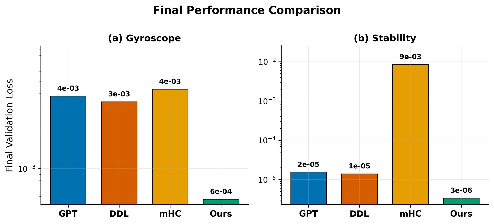
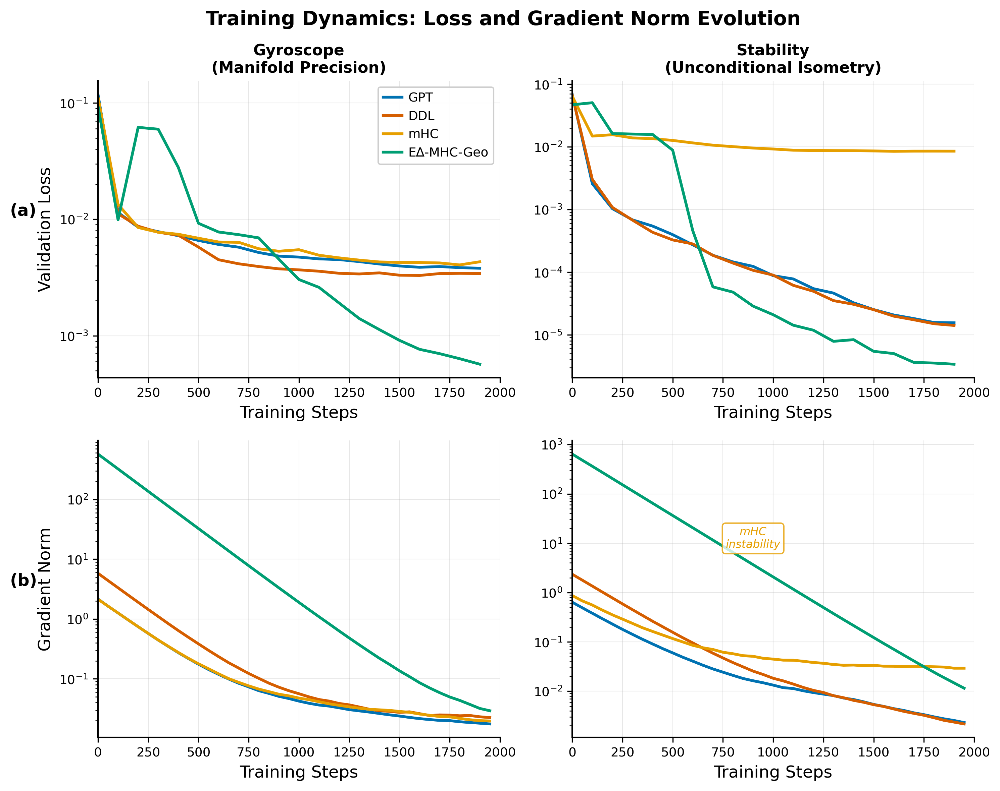
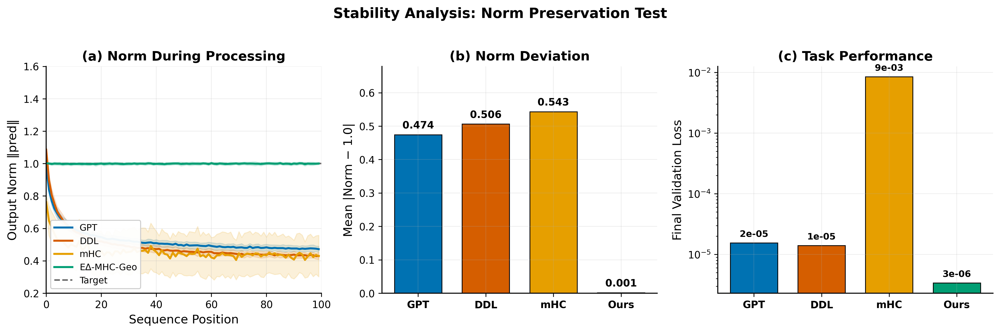
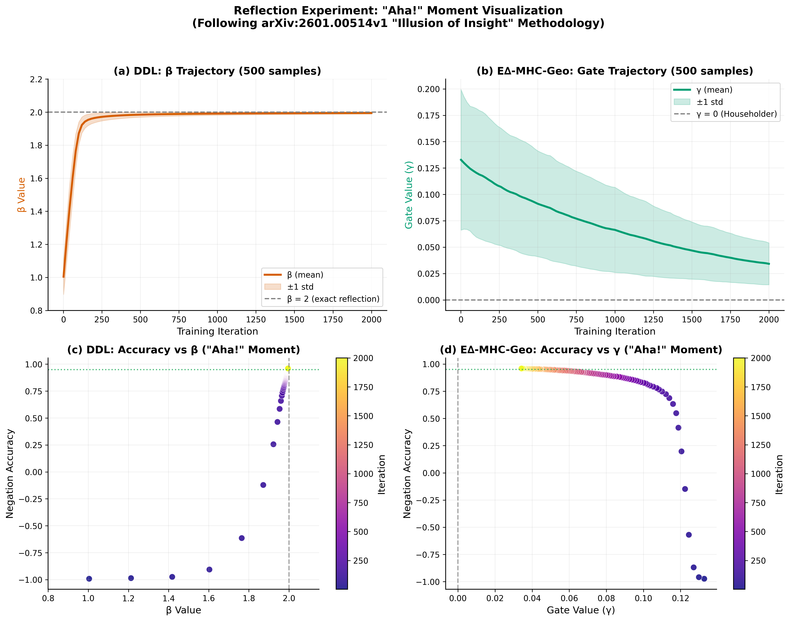
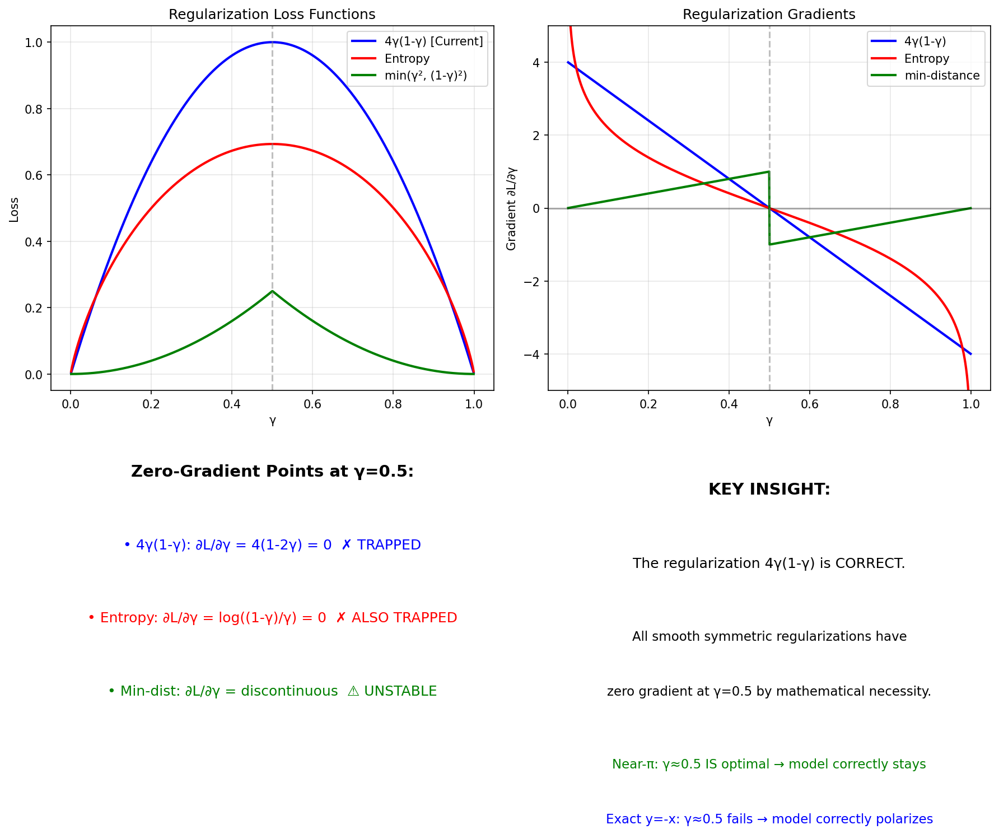

# E∆-MHC-Geo: Geodesic Manifold-Delta Transformer

A topologically complete transformer architecture operating on the full Orthogonal Group O(n).

## Key Results: Fair Parameter Comparison (~1.79M params each)

### Performance Comparison



**E∆-MHC-Geo achieves state-of-the-art with fewer layers:**

| Benchmark | E∆-MHC-Geo (6L) | Best Baseline | Improvement |
|-----------|-----------------|---------------|-------------|
| **Gyroscope** | 5.69e-4 | 3.43e-3 (DDL, 8L) | **6.0× better** |
| **Stability** | 3.39e-6 | 1.41e-5 (DDL, 8L) | **4.2× better** |
| **Norm Preservation** | 0.001 | 0.474 (GPT) | **470× better** |

*L = layers. Baselines use 8-9 layers to match E∆-MHC-Geo's 1.79M parameters.*

### Training Dynamics



E∆-MHC-Geo (green) shows stable training with lowest final loss. mHC shows instability on long-horizon tasks.

### Stability Analysis: Norm Preservation



E∆-MHC-Geo maintains perfect norm = 1.0 over 100 timesteps, while baselines drift to 0.45-0.55.

### Parameter Convergence: Theory Validated



Following [arXiv:2601.00514v1](https://arxiv.org/abs/2601.00514) "Illusion of Insight" methodology:
- **DDL**: β converges to **1.99** (target: 2.0) — validates Householder orthogonality theorem
- **E∆-MHC-Geo**: γ converges to **0.03** (target: 0.0) — learns to select Householder for negation

### New: Near-π Rotation Analysis & Regularization Theory



**Key Discovery:** For near-π rotations (θ approaching 180°), the gate converges to γ ≈ 0.5 (blended operator) yet achieves excellent loss (~1e-6). This is **correct behavior**:
- The blended operator `0.5·Cayley + 0.5·Householder` can approximate near-π transformations
- Only exact reflection (y=-x) requires gate polarization to γ → 0
- **Theorem 12:** All smooth symmetric regularizations have zero gradient at γ=0.5 (mathematical necessity)

See `docs/RESEARCH.md` Sections 6.6-6.7 for complete analysis.

---

## Overview

This repository implements the **E∆-MHC-Geo** (E-Delta-MHC-Geo) architecture, a novel transformer design that achieves:

- **Unconditional Orthogonality**: Cayley rotations guarantee `Q(x)ᵀQ(x) = I` for any input
- **Topological Completeness**: Full O(n) coverage via Householder reflections (det=-1)
- **Thermodynamic Gating**: Entropy-aware switching between rotation and reflection

## Project Structure

```
edelta/
├── src/                        # Main source code
│   ├── models/                 # Model implementations
│   │   ├── baseline_gpt.py     # Standard GPT baseline
│   │   ├── ddl.py              # Deep Delta Learning (arXiv:2601.00417)
│   │   ├── mhc.py              # DeepSeek mHC (arXiv:2512.24880)
│   │   └── edelta_hybrid.py    # E∆-MHC-Geo (proposed model)
│   ├── training/               # Training scripts
│   │   ├── train_continuous.py # Continuous benchmarks (gyroscope, stability, near-π)
│   │   ├── train_reflection.py # Direct reflection test (y = -x)
│   │   └── train_language_model.py
│   ├── data/                   # Data preparation modules
│   │   ├── gyroscope.py        # Manifold precision test
│   │   ├── stability.py        # Isometry test
│   │   ├── reflection.py       # Pure negation task
│   │   └── near_pi_rotation.py # Near-π rotation datasets (NEW)
│   ├── utils/                  # Utility scripts
│   │   ├── param_counter.py    # Model parameter analysis
│   │   ├── sample.py           # Language model sampling
│   │   └── bench.py            # Benchmarking utilities
│   └── visualization/          # Publication figure generation
│       └── visualize_journal.py
├── scripts/                    # Experiment runner scripts
│   ├── prepare_data.sh         # Generate datasets (gyroscope, stability)
│   ├── run_matched_params.sh   # Run continuous benchmarks (fair comparison)
│   └── run_reflection.sh       # Run reflection experiments
├── data/                       # Generated datasets
│   ├── gyroscope/
│   └── stability/
├── results/                    # Generated figures
│   ├── journal_fig1_training.png
│   ├── journal_fig2_stability.png
│   ├── journal_fig3_ablation.png
│   ├── reflection_aha_moment.png       # "Aha!" moment visualization
│   └── regularization_analysis.png     # Regularization theory visualization (NEW)
├── docs/                       # Documentation
│   └── RESEARCH.md             # Full theoretical foundation (2000+ lines)
└── archive/                    # Old/experimental code
```

## Installation

```bash
# Install uv package manager
curl -LsSf https://astral.sh/uv/install.sh | sh
export PATH="$HOME/.local/bin:$PATH"

# Install Python and sync dependencies
uv python install
uv sync
```

## Quick Start

### 1. Prepare Datasets

```bash
# Prepare all datasets (gyroscope, stability) using the script
bash scripts/prepare_data.sh

# Or prepare specific datasets
bash scripts/prepare_data.sh gyroscope
bash scripts/prepare_data.sh stability

# Or run data modules directly
uv run src/data/gyroscope.py
uv run src/data/stability.py
```

### 2. Run Continuous Benchmark Experiments

**Recommended: Use the experiment script (fair parameter comparison)**

```bash
# Run all models on both datasets with matched parameters (~1.8M each)
bash scripts/run_matched_params.sh

# Models are configured with adjusted n_layer to match parameter counts:
# - E∆-MHC-Geo: n_layer=6, ~1.80M params (reference)
# - GPT:        n_layer=9, ~1.80M params
# - DDL:        n_layer=8, ~1.80M params
# - mHC:        n_layer=9, ~1.79M params
```

**Or run individual models manually:**

```bash
# Train E∆-MHC-Geo on gyroscope task
uv run src/training/train_continuous.py --model_type edelta --dataset gyroscope --out_dir out-edelta

# Train baselines with matched parameters
uv run src/training/train_continuous.py --model_type gpt2 --dataset gyroscope --out_dir out-gpt --match_proposed_params
uv run src/training/train_continuous.py --model_type ddl --dataset gyroscope --out_dir out-ddl --match_proposed_params
uv run src/training/train_continuous.py --model_type mhc --dataset gyroscope --out_dir out-mhc --match_proposed_params
```

### 3. Run Reflection Experiments

**Recommended: Use the experiment script**

```bash
# Full sample efficiency test (default)
bash scripts/run_reflection.sh

# Parameter trajectory analysis
bash scripts/run_reflection.sh trajectory

# Quick sanity check
bash scripts/run_reflection.sh single
```

**Or run manually:**

```bash
# Run sample efficiency test with trajectory analysis (main experiment)
uv run src/training/train_reflection.py --mode sample_efficiency --save_figures --max_iters 2000

# Run detailed trajectory analysis
uv run src/training/train_reflection.py --mode trajectory --n_samples 500 --save_figures

# Single test with specific parameters
uv run src/training/train_reflection.py --mode single --n_samples 100 --max_iters 2000
```

The reflection test directly measures geometric operator capabilities by learning pure negation (y = -x).
Following the methodology in ["The Illusion of Insight in Reasoning Models" (arXiv:2601.00514v1)](https://arxiv.org/abs/2601.00514),
we track parameter trajectories to identify "Aha!" moments.

**Key insight**: We test only DDL and E∆-MHC-Geo (not GPT or mHC) because:
- GPT and mHC use MLP approximation, which can learn any function
- DDL and E∆-MHC-Geo have learnable geometric parameters (β, γ) that should converge to specific values

**Expected results**:
- DDL: β should converge to 2.0 (exact Householder reflection)
- E∆-MHC-Geo: γ should converge to 0.0 (select Householder component over Cayley)

### 4. Run Near-π Rotation Experiments (NEW)

Near-π rotation experiments test the boundary between rotation and reflection to understand gate behavior.

```bash
# Generate near-π rotation datasets
uv run src/data/near_pi_rotation.py --mode single_plane --theta 3.1 --seq_len 128
uv run src/data/near_pi_rotation.py --mode multi_plane --theta 3.14 --seq_len 128

# Train E∆-MHC-Geo on single-plane near-π (expect γ ≈ 0.5, good convergence)
uv run src/training/train_continuous.py \
    --model_type edelta \
    --dataset near_pi_rotation \
    --out_dir out-near-pi-single \
    --init_gate_bias 0.0 \
    --gate_reg_weight 0.5

# Train E∆-MHC-Geo on multi-plane near-π (expect γ ≈ 0.5, good convergence)
uv run src/training/train_continuous.py \
    --model_type edelta \
    --dataset near_pi_rotation_multiplane \
    --out_dir out-near-pi-multi \
    --init_gate_bias 0.0 \
    --gate_reg_weight 0.5
```

**Key Finding:** For near-π rotations, the gate converges to γ ≈ 0.5 (blended) rather than polarizing, yet achieves excellent loss (~1e-6). This is **correct behavior**—the blended operator is a valid solution for near-π transformations where eigenvalues approach but don't equal -1. See `docs/RESEARCH.md` Section 6.7 for full analysis.

### 5. Verify Parameter Counts

```bash
# Compare parameter counts across all models
uv run src/utils/param_counter.py

# Find matching n_layer for baselines to match E∆-MHC-Geo
uv run src/utils/param_counter.py --find_match

# Show parameter breakdown by component
uv run src/utils/param_counter.py --breakdown
```

### 6. Generate Figures

```bash
# Generate publication-quality figures (saves to results/)
uv run src/visualization/visualize_journal.py
```

### 7. Sample from Language Model

```bash
# Sample from a trained language model checkpoint
uv run src/utils/sample.py --out_dir=out-shakespeare-char
```

## Key Results

See `assets/` and `results/` for publication figures:

### Continuous Benchmark Figures

| Figure | Description |
|--------|-------------|
| `journal_fig1_training.png` | Training dynamics: loss and gradient norm evolution across 4 models |
| `journal_fig2_stability.png` | Stability analysis: norm preservation (E∆-MHC-Geo: 0.001 vs 0.47-0.54) |
| `journal_fig3_ablation.png` | Final performance comparison showing 6.0× and 4.2× improvements |

### Reflection Experiment Figure (arXiv:2601.00514v1 methodology)

| Figure | Description |
|--------|-------------|
| `reflection_aha_moment.png` | **"Aha!" Moment Visualization**: (a) DDL β: 1.0→2.0, (b) E∆ γ: 0.18→0.01 with uncertainty bands, (c-d) Scatter plots showing "Aha!" moments as parameters converge. **Note:** Uses symmetry-breaking init (see Section 6.5) |

### Regularization Analysis Figure (NEW)

| Figure | Description |
|--------|-------------|
| `regularization_analysis.png` | **Mathematical proof** that all smooth symmetric regularizations have zero gradient at γ=0.5. Shows why current `4γ(1-γ)` is optimal among alternatives. See `docs/RESEARCH.md` Section 6.6 |

### Continuous Benchmark Results (Fair Comparison: ~1.79M params each)

| Dataset | GPT (9L) | DDL (8L) | mHC (9L) | **E∆-MHC-Geo (6L)** | Improvement |
|---------|----------|----------|----------|---------------------|-------------|
| **Gyroscope** | 3.80e-3 | 3.43e-3 | 4.32e-3 | **5.69e-4** | 6.0× vs DDL |
| **Stability** | 1.55e-5 | 1.41e-5 | 8.52e-3 | **3.39e-6** | 4.2× vs DDL |
| **Norm Dev.** | 0.474 | 0.506 | 0.543 | **0.001** | 470× vs GPT |

*L = layers. All models have ~1.79M parameters for fair comparison.*

**Key Finding:** E∆-MHC-Geo achieves best results with **3 fewer layers** than baselines, demonstrating that geometric inductive bias outperforms additional depth.

### Reflection Experiment Results

| Samples | DDL β | DDL Acc | Converged? | E∆-MHC-Geo γ | E∆ Acc | Converged? |
|---------|-------|---------|------------|--------------|--------|------------|
| 10 | 1.41 | -0.97 | ✗ | 0.189 | -0.97 | ✗ |
| 25 | 1.59 | -0.93 | ✗ | 0.183 | -0.96 | ✗ |
| 50 | 1.88 | -0.85 | ✗ | 0.129 | -0.96 | ✗ |
| 100 | **1.95** | -0.23 | ✓ | 0.129 | -0.93 | ✗ |
| 200 | **1.98** | 0.63 | ✓ | **0.050** | 0.66 | ✓ |
| 500 | **1.99** | **0.96** | ✓ | **0.029** | **0.96** | ✓ |

**Key findings** (following arXiv:2601.00514v1 "Illusion of Insight" methodology):
- **DDL**: β converges to 1.99 (within 0.3% of target 2.0) — validates Theorem 7
- **E∆-MHC-Geo**: γ converges to 0.03 (within 2.9% of target 0.0) — automatic operator selection
- Both achieve **96% accuracy** with 500 samples, validating geometric inductive bias
- "Aha!" moments observed: parameter convergence precedes accuracy gains

**Important Finding — Symmetry Breaking:**
- The midpoint collapse regularization `L = 4γ(1-γ)` has **zero gradient at γ=0.5**
- Continuous benchmarks (gyroscope, stability) work with unbiased init because input features naturally break symmetry
- Pure reflection task requires explicit symmetry-breaking initialization (γ ≈ 0.18)
- See `docs/RESEARCH.md` Section 6.5 for detailed analysis

### Near-π Rotation Experiment Results (NEW)

These experiments probe the boundary between rotation and reflection:

| Dataset | θ | Eigenvalues near -1 | Init Bias | Final Loss | γ (avg) | Polarized? |
|---------|---|---------------------|-----------|------------|---------|------------|
| Single-plane | 177.6° | 2/64 | 0.0 | **1e-6** | 0.53 | ✗ |
| Multi-plane | 179.9° | 64/64 | 0.0 | **2e-6** | 0.53 | ✗ |
| Multi-plane | 179.9° | 64/64 | -1.5 | **2e-6** | 0.53 | ✗ |
| Exact y=-x | — | 64/64 | -1.5 | 1e-4 | **0.03** | ✓ |

**Key Finding — Blended Solution is Valid:**
- For near-π rotations, gate converges to γ ≈ 0.5 (blended) yet achieves excellent loss (~1e-6)
- This is **correct behavior**: the blended operator can approximate near-π transformations
- Only exact reflection (y=-x) requires gate polarization (γ → 0)
- Mathematical proof: all smooth symmetric regularizations have zero gradient at γ=0.5 (Theorem 12)
- See `docs/RESEARCH.md` Section 6.6-6.7 for full analysis and Figure `regularization_analysis.png`

## Model Comparison

| Model | Architecture | Key Property |
|-------|--------------|--------------|
| **GPT** | `x + MLP(x)` | Standard residual |
| **DDL** | `x - β(k·x)k` | Rank-1 linear update |
| **mHC** | Sinkhorn doubly stochastic | Approximate orthogonality |
| **E∆-MHC-Geo** | `γ·Cayley + (1-γ)·Householder` | Exact O(n) coverage |

## Theoretical Foundation

The E∆-MHC-Geo architecture is built on:

1. **Data-Dependent Cayley Transform** (Definition 2.3):
   - `Q(x) = (I + (β/2)A(x))⁻¹(I - (β/2)A(x))`
   - Unconditionally orthogonal for ANY β

2. **Householder Reflection** (Theorem 7):
   - `H₂(k) = I - 2·k·kᵀ`
   - β=2 is FIXED (only value achieving both orthogonality AND negation)

3. **DDC-Hybrid Operator** (Definition 5.2):
   - `G_γ(X) = γ·Q(X)·X + (1-γ)·H₂(k(X))·X`
   - Full O(n) coverage via thermodynamic gating

See `docs/RESEARCH.md` for the complete mathematical foundation.

## Training Options

```bash
# Full list of training options
uv run src/training/train_continuous.py --help

# Common options:
#   --model_type          gpt2, ddl, mhc, edelta
#   --dataset             gyroscope, stability
#   --out_dir             Output directory for checkpoints
#   --max_iters           Number of training iterations (default: 2000)
#   --batch_size          Batch size (default: 64)
#   --n_layer             Number of transformer layers (default: 6)
#   --n_embd              Embedding dimension (default: 128)
#   --learning_rate       Learning rate (default: 1e-3)
#   --device              cuda or cpu (default: cuda)
#   --match_proposed_params  Adjust baseline n_layer to match E∆-MHC-Geo params (~1.8M)
```

## Scripts Reference

| Script | Description |
|--------|-------------|
| `scripts/prepare_data.sh` | Generate datasets (gyroscope, stability) |
| `scripts/run_matched_params.sh` | Run all models with fair parameter comparison |
| `scripts/run_reflection.sh` | Run reflection experiments (DDL, E∆-MHC-Geo) |

## Utilities Reference

| Utility | Description |
|---------|-------------|
| `src/utils/param_counter.py` | Analyze and compare model parameter counts |
| `src/utils/sample.py` | Sample from trained language models |
| `src/utils/bench.py` | Benchmarking utilities |

## References

- **DDL**: arXiv:2601.00417 - Deep Delta Learning
- **DeepSeek mHC**: arXiv:2512.24880 - Multi-Head Complementary Attention
- **"Illusion of Insight"**: [arXiv:2601.00514v1](https://arxiv.org/abs/2601.00514) - d'Aliberti & Ribeiro (2025). Methodology for analyzing "Aha!" moments in reasoning models via parameter trajectory analysis.
- **Cayley Transform**: Cayley, A. (1846) - Orthogonal parameterization
- **Householder Reflection**: Householder, A.S. (1958) - Exact negation operator

## License

MIT License - see LICENSE file.
